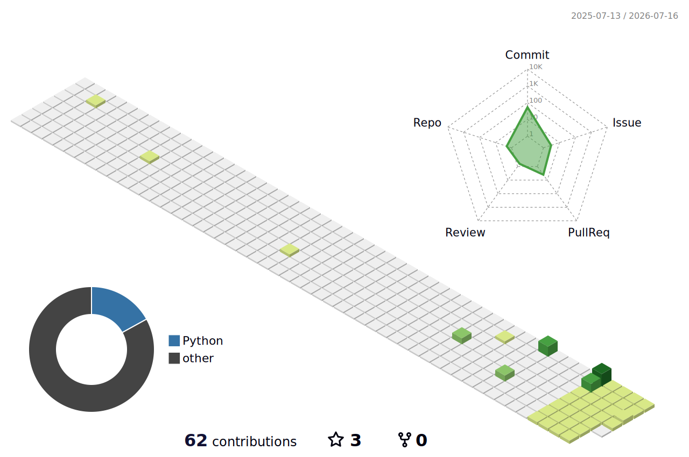

<!--   my-icons -->
<p align="center">
    <a href="https://github.com/Miraitowa-zcx"></a>
    <a href="https://github.com/golang/go"></a>
    <a href="https://github.com/Miraitowa-zcx/graphs/contributors"></a>
    <a href="https://github.com/Miraitowa-zcx/stargazers"></a>
    <a href="https://github.com/Miraitowa-zcx/network/members"></a>
       
</p>

<!--   my-header-img -->

<a href="https://go.dev/"></a>


<!--   my-ticker -->    
[](https://git.io/typing-svg)


<!--   my-skils -->

| Property             | Data                                                                                                                                                                                                                                                                                                                                                                                                                                                                                                                                                                                                                                                                                                                                                                                                                                                              |
|----------------------|-------------------------------------------------------------------------------------------------------------------------------------------------------------------------------------------------------------------------------------------------------------------------------------------------------------------------------------------------------------------------------------------------------------------------------------------------------------------------------------------------------------------------------------------------------------------------------------------------------------------------------------------------------------------------------------------------------------------------------------------------------------------------------------------------------------------------------------------------------------------|
| **Language / IDE**   |         |
| **Domain Knowledge** | [](https://github.com/Miraitowa-zcx) [](https://github.com/Miraitowa-zcx) [](https://github.com/Miraitowa-zcx) [](https://github.com/Miraitowa-zcx)                                                                                                                                                                                                                                                                                                   |
| **CI / CD**          |                                                                                                              |
| **Databases**        |                                                                                                                                                                                                                   |
| **Frameworks**       |                                                                                                                                                                                                                                                |

<!--   GitHub stats graph -->

### 📈 GitHub Activity Graph:

<!--   green snake -->

<!--   stats + languages -->

| .                                                                                                                                                         | .                                                                                                                                       |
|-----------------------------------------------------------------------------------------------------------------------------------------------------------|-----------------------------------------------------------------------------------------------------------------------------------------|
|  |  |

</img>

<!-- dark snake -->


<!--   profile-green-animate -->


<!--   grid-snake  -->


<!--   skyline -->
<p align="center">
<a href="https://github.com/Miraitowa-zcx/Miraitowa-zcx/blob/master/assets/2024.stl">

</a>
</p>

<!--  TOP codersrank для обновления картинки нужно обновить профиль на странице https://profile.codersrank.io/user/miraitowa-zcx-->


<!--  2d history skills для обновления картинки нужно обновить профиль на странице https://profile.codersrank.io/user/miraitowa-zcx-->
</img>

**📫 How to Reach me:**
<p align="center">
<a href="https://twitter.com/Miraitowa_zcx" target="blank"></a>
<a href="https://linkedin.com/in/Miraitowa-zcx" target="blank"></a>
<a href="mailto:2038322151@qq.com" target="blank"></a>
</p>

<div align="center">
<summary>Trophy: Github Profile Trophy</summary>
</div>

<p align="center">
<a href="https://github.com/ryo-ma/github-profile-trophy">

</a>
</p>

<!--microservices-->

```mermaid
graph TD
;
    microservices --> API-Gateway;
    microservices --> Service-Discovery;
    microservices --> Load-Balancing;
    microservices --> Circuit-Breaker;
    microservices --> Event-Driven;
    microservices --> CQRS;
   ```


#### Thanks for visiting :heart:

<p align="center"> 
  

## Star History

[](https://star-history.com/#Miraitowa-zcx/Miraitowa-zcx&Date)

### Profile Views


</br>


[MIT](LICENSE)


---
  *If you liked my profile, you can Star ⭐ the repo and if you want to use this template you can Fork it and can use.* 
---
Would you like to meet me?

If you want to contribute to any of my repositories, feel free to submit PRs, issues and email me. Pick a slot if you'd like to meet me and chat about proposals and ideas - but make sure to describe the agenda

---


[for the future hacker...](https://referral.hackthebox.com/mz8gTFM)


